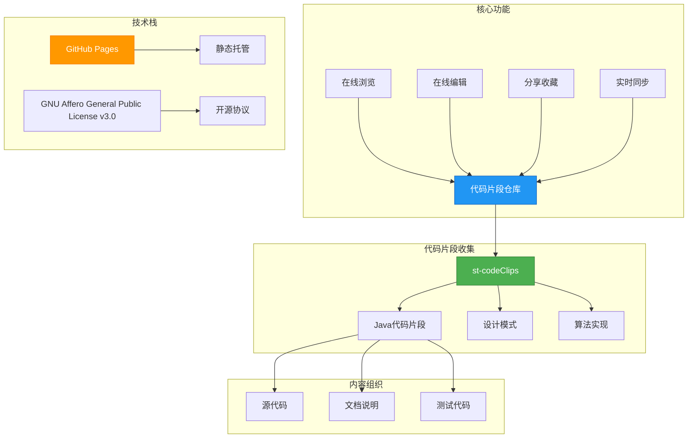

# :star2: st-codeClips.github.io

st-codeClips.github.io 项目旨在收集并保存优秀的编程代码片段，以及设计模式，这些代码片段和设计模式可以作为技术积累来使用。每个文件夹就是一个编程代码片段，里面包含了源代码和文档，以及可能的测试代码。

## 📊 项目架构图

## 主要功能

st-codeClips.github.io 项目的主要功能有：

- 存储和分享优秀的编程代码片段，以及设计模式；
- 每个文件夹就是一个代码切片，里面包含了源代码和文档，以及可能的测试代码；
- 支持在线浏览，编辑，分享和收藏代码片段；
- 实时同步代码片段，确保数据安全。

## 快速开始

如果你想要快速开始使用 st-codeClips.github.io 项目，可以按照以下步骤：

1. 注册一个 Github 账号；
2. Fork st-codeClips.github.io 项目；
3. 下载代码片段到本地；
4. 在本地编辑代码片段；
5. 上传修改后的代码片段到 Github；
6. 分享代码片段。

## 贡献

如果你有任何想法或建议，欢迎在 Github 上提交 issue 或者 pull request。

## 许可证

st-codeClips.github.io 项目使用 [MIT](https://github.com/wo1261931780/st-codeClips.github.io/blob/master/LICENSE) 许可证发布。
